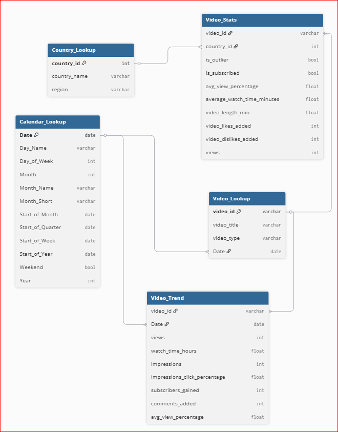
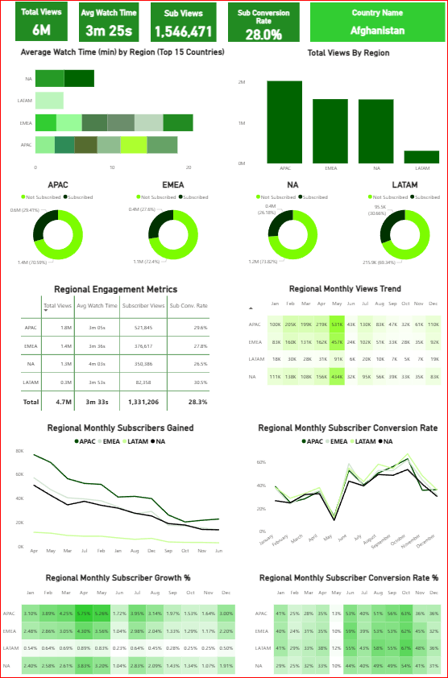
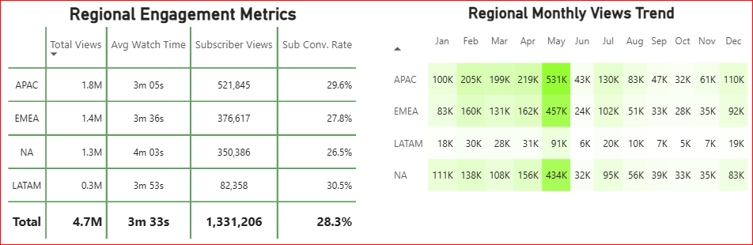
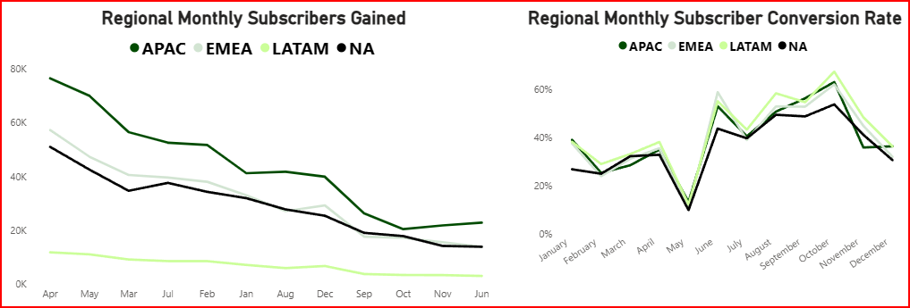
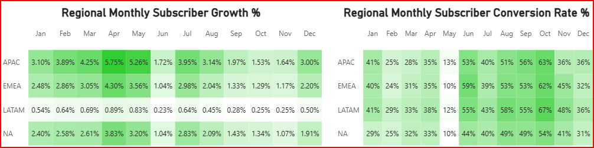

# YouTube Regional Engagement Analysis

## Table of Contents

- [YouTube Regional Engagement Analysis](#youtube-regional-engagement-analysis)
- [Project Background](#project-background)
- [Data Structure & Initial Checks](#data-structure--initial-checks)
- [Executive Summary](#executive-summary)
  - [Key Findings](#key-findings)
- [Insights Deep Dive](#insights-deep-dive)
  - [Section 1: Regional Watch Time & Total Views](#section-1-regional-watch-time--total-views)
  - [Section 2: Subscriber Conversion & Engagement Rates](#section-2-subscriber-conversion--engagement-rates)
  - [Section 3: Monthly Subscriber Trends & Growth](#section-3-monthly-subscriber-trends--growth)
  - [Section 4: Strategic Regional Opportunities](#section-4-strategic-regional-opportunities)
- [Recommendations](#recommendations)
- [Assumptions and Caveats](#assumptions-and-caveats)
- [Questions for Stakeholders Before Strategic Rollout](#questions-for-stakeholders-before-strategic-rollout)

## Project Background

Ken Jee is a prominent content creator in the data science and analytics industry, known for sharing practical tutorials and career advice. His YouTube channel operates on an audience-engagement business model, where monetization is driven by views, watch time, and subscriber growth. This analysis was conducted from the perspective of a data analyst supporting the channel’s strategic decision-making.

The goal of this project was to answer the question:  
**“How do viewer engagement metrics vary across regions, and which regions are showing upward trends in engagement and subscriber growth over time?”**

Insights and recommendations are provided on the following key areas:

- **Regional Watch Time & Total Views** 
- **Subscriber Conversion & Engagement Rates** 
- **Monthly Subscriber Trends & Growth** 
- **Strategic Regional Opportunities** 

An interactive Power BI dashboard used to explore performance trends can be found within the repository labelled: [youtube_analytics_project.pbix].

---

## Data Structure & Initial Checks

The channels' video data's main database structure includes five core tables:

- `Country_Lookup`: Maps `country_id` to country and region (APAC, NA, EMEA, LATAM)
- `Calendar_Lookup`: Provides month, quarter, year mapping
- `Video_Stats`: Engagement metrics (watch time, likes, views, sub conversion)
- `Video_Lookup`: Basic metadata (video title, type, publish date)
- `Video_Trend`: Tracks trend metrics daily (impressions, conversions, watch%)

---

## Executive Summary

The analysis, based on 2020-2022 Ken Jee YouTube video data, revealed strong regional disparities in viewer behaviour and subscriber growth across APAC, EMEA, NA, and LATAM. APAC lead in total views and subscriber count, accounting for nearly 40% of total engagement, while NA showed the highest average watch time at over 4 minutes per session. LATAM, although contributing only 6% of total views, demonstrated the highest subscriber conversion rate at 30.5%, signalling untapped potential.

Video performance peaks consistently during Q2, especially in May, suggesting an opportunity to focus campaigns around this period. Subscriber growth trends show early-year strength but taper off mid-year, highlighting the need for consistent retention strategies and content refreshes. Localised focused content in LATAM and long-form, high-retention content in NA are potentially strategic levers for driving further channel growth. These insights can guide content planning, regional targeting, and investment in personalization to maximize channel performance and audience retention.

### Key Findings

1. APAC leads in total views (1.8M) and subscribers, making it the most scalable region.
2. LATAM has the highest conversion rate (30.5%), signalling a highly engaged audience.
3. NA has the highest average watch time (4m 03s), making it ideal for monetisation strategies.

---

## Insights Deep Dive

### Section 1: Regional Watch Time & Total Views

- APAC peaks in May with 531K views; average watch time: 3m 05s
- EMEA maintains steady growth; watch time: 3m 36s
- NA has the deepest engagement with 4m 03s average watch time
- LATAM lowest total views (0.3M); however, worth investing in due to a significant subscriber conversion rate

---

### Section 2: Subscriber Conversion & Engagement Rates

- LATAM has the highest conversion rate: 67%
- Peak months for conversion: June - October
- All Regions display a steady decline in subscribers gained monthly throughout the year
- NA lags slightly despite strong engagement

---

### Section 3: Monthly Subscriber Trends & Growth

- Highest subscriber gains in APAC and EMEA
- Strong growth in April and May, especially in APAC (5.75%)
- LATAM’s growth % is low; however, conversion efficiency is high

---

### Section 4: Strategic Regional Opportunities

- LATAM shows the highest conversion rate but low view count, indicating strong audience potential if better targeted.
- NA has the longest average watch time, making it ideal for long-form content that benefits from strong retention.
- APAC leads in views and subscriber volume, making it the most effective region to pilot and scale new content.
- EMEA has stable metrics but diverse audiences, suggesting localisation is needed to boost relevance and engagement.

---

## Recommendations

For the Content Strategy Team:

- Translate and localise content for LATAM to increase viewership while maintaining a high conversion rate
- Use NA as a hub for long-form educational videos, utilising the region's significant viewer engagement
- Invest in Q2 campaigns, especially May, when all regions peak
- Launch experimental content in APAC due to its scalable and growth position
- Re-evaluate strategy for EMEA, consider subtitling to localise content and boost engagement as a result

---

## Assumptions and Caveats

Several assumptions were made during analysis to manage data quality, regional inconsistencies, and temporal alignment. These are outlined below:

- Incomplete Region Mapping: A small number of records lacked region or country identifiers. These were either excluded from region-specific analyses or categorised under a general "Other" label to prevent distortion in regional insights.
- Outlier Handling: Records marked with `is_outlier = TRUE` (typically videos with unusually high or low metrics) were excluded to avoid skewing averages and regional comparisons. These outliers often represent viral anomalies that don’t reflect typical performance trends.
- Temporal Aggregation Limitations: Metrics were primarily aggregated at the monthly level. This may obscure short-term spikes or dips (e.g., campaign launches or viral moments), particularly when analysing subscriber trends or engagement bursts.
- Time Zone Normalisation: Video upload timestamps and engagement data were not normalised to a single time zone. This could lead to slight misalignments in daily trends, particularly when comparing peak performance across global regions.
- Missing Commentary and Engagement Metrics: Comments and likes data were excluded from this version of the report due to incomplete coverage across regions and video categories. These may be explored in a follow-up analysis for qualitative insight.
  
---

## Questions for Stakeholders Before Strategic Rollout

- Regional Mapping Consistency
  - Should the regional grouping (APAC, EMEA, NA, LATAM) follow YouTube’s internal schema, or be adjusted based on marketing segmentation?
  - How should countries without an assigned region be treated (e.g., "Other", unknown)?

- Watch Time Interpretation
  - Should watch time be assessed by average per video or total minutes watched per region when deciding content length strategies?
  - Is there a minimum engagement threshold that defines "high-performing" content?

- Subscriber Growth vs. Conversion
  - Should higher subscriber conversion rates (like in LATAM) be prioritised over higher subscriber volume (like APAC)?
  - How should we define success: absolute subscriber gain or percentage growth/conversion?

- Campaign Timing and Seasonality
  - Are there known marketing pushes (e.g., course launches, collabs) during months like May and October that could explain engagement spikes?
  - Should campaigns be uniformly launched across regions, or staggered to reflect historical performance trends?

- Localisation Strategy
  - What content localisation strategies (translation, subtitling, region-specific topics) can be used?
  - Is there a drive to test region-specific playlists or region-led community engagement efforts?

---

