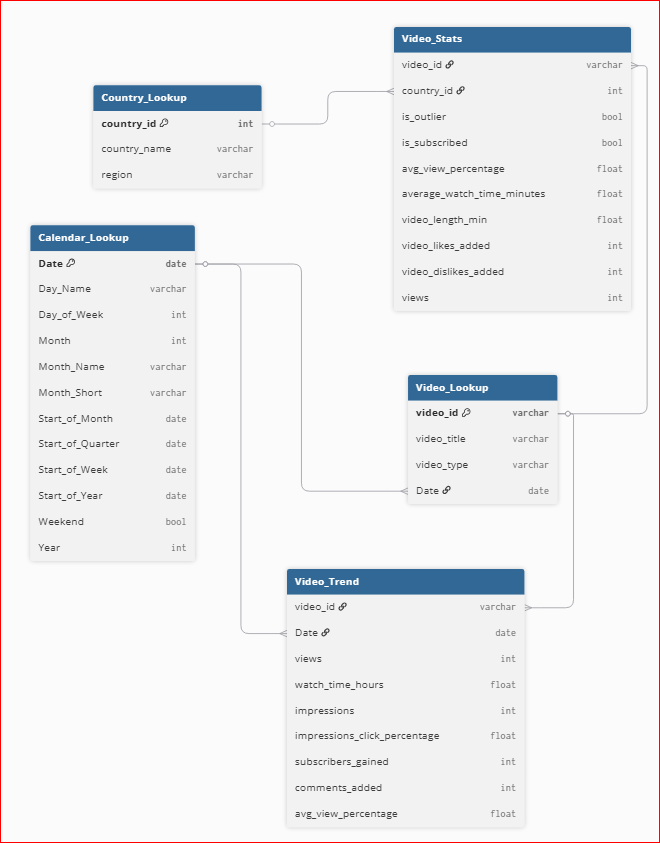
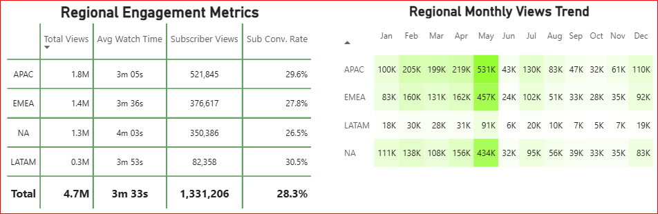

# YouTube Regional Engagement Analysis 📊

## Project Background

Ken Jee is a prominent content creator in the data science and analytics industry, known for sharing practical tutorials and career advice. His YouTube channel operates on an audience-engagement business model, where monetization is driven by views, watch time, and subscriber growth. This analysis was conducted from the perspective of a data analyst supporting the channel’s strategic decision-making.

The goal of this project was to answer the question:  
**“How do viewer engagement metrics vary across regions, and which regions are showing upward trends in engagement and subscriber growth over time?”**

Insights and recommendations are provided on the following key areas:

- **Category 1:** Regional Watch Time & Total Views
- **Category 2:** Subscriber Conversion & Engagement Rates
- **Category 3:** Monthly Subscriber Trends & Growth
- **Category 4:** Strategic Regional Opportunities

🗃️ **SQL queries** for inspection and cleaning [link]  
📊 **Power BI Dashboard** [link]  
📁 **Dataset & visuals** are stored in `Raw Initial Data` and `Images`

---

## 📁 Data Structure & Initial Checks

The company’s main database structure includes five core tables, with over 6 million rows tracked over time:

- `Country_Lookup`: Maps `country_id` to country and region (APAC, NA, EMEA, LATAM)
- `Calendar_Lookup`: Provides month, quarter, year mapping
- `Video_Stats`: Engagement metrics (watch time, likes, views, sub conversion)
- `Video_Lookup`: Basic metadata (video title, type, publish date)
- `Video_Trend`: Tracks trend metrics daily (impressions, conversions, watch %)



---

## 🚀 Executive Summary

### Key Findings

1. **APAC** leads in total views (1.8M) and subscribers, making it the most scalable region.
2. **LATAM** has the **highest conversion rate (30.5%)**, indicating a highly engaged audience.
3. **NA** has the **highest average watch time (4m 03s)**, ideal for monetization strategies.


---

## 🔍 Insights Deep Dive

### 📌 Category 1: Regional Watch Time & Total Views

- **APAC** peaks in May with 531K views; average watch time: 3m 05s
- **EMEA** maintains steady growth; watch time: 3m 36s
- **NA** has the **deepest engagement** with 4m 03s avg watch time
- **LATAM** lowest total views (0.3M) but worth investing in



---

### 📌 Category 2: Subscriber Conversion & Engagement Rates

- **LATAM** has the **highest conversion rate: 30.5%**
- **Peak months** for conversion: August–October
- **EMEA** steady high rates (~28%)
- **NA** lags slightly despite strong engagement


---

### 📌 Category 3: Monthly Subscriber Trends & Growth

- **Highest subscriber gains** in APAC and EMEA
- **Strong growth in April and May**, especially in APAC (5.75%)
- **LATAM’s growth %** is low but conversion efficiency is high


---

### 📌 Category 4: Strategic Regional Opportunities

- **LATAM** is under-tapped — high conversion but low exposure
- **NA** is best for long-form content due to high retention
- **APAC** should remain the launch region for new content
- **EMEA** needs localization/personalization strategies

---

## ✅ Recommendations

For the **Content Strategy Team**:

- 🎯 **Translate/localize content for LATAM** to increase viewership while maintaining high conversion
- 📚 Use **NA** as a hub for long-form educational videos
- 📈 **Invest in Q2 campaigns**, especially May when all regions peak
- 🌍 Launch experimental content in **APAC** — scalable and growing
- 🔄 Re-evaluate strategy for EMEA — consider subtitling and SEO targeting

---

## ⚠️ Assumptions and Caveats

- Some countries missing region tags were excluded or lumped into "Other"
- `is_outlier = TRUE` values were filtered out to reduce noise
- Monthly-level aggregations may hide campaign spikes
- No time zone normalization applied to posting dates

---

**Repository Structure**

```
Youtube_Prod/
├── Images/
│   ├── Complete_Dashboard.png
│   ├── Dashboard.png
│   ├── ERD.png
│   ├── Regional_Stats.png
│   ├── Trend_Charts.png
│   └── Trend_Heatmaps.png
├── Raw Initial Data/
│   ├── Aggregated_Metrics_By_Country_And_Time.csv
│   ├── Aggregated_Metrics_By_Video.csv
│   ├── All_Comments_Final.csv
│   └── Video_Performance_Over_Time.csv
├── Misc/
│   └── green-theme.json
├── Youtube_Project_Data.xlsx
├── youtube_analytics_project.pbix
└── README.md
```
